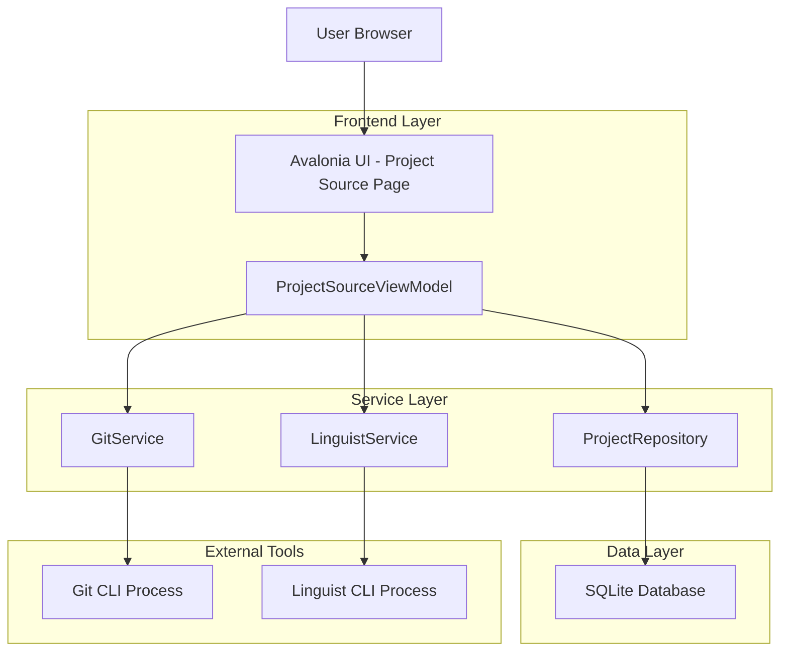
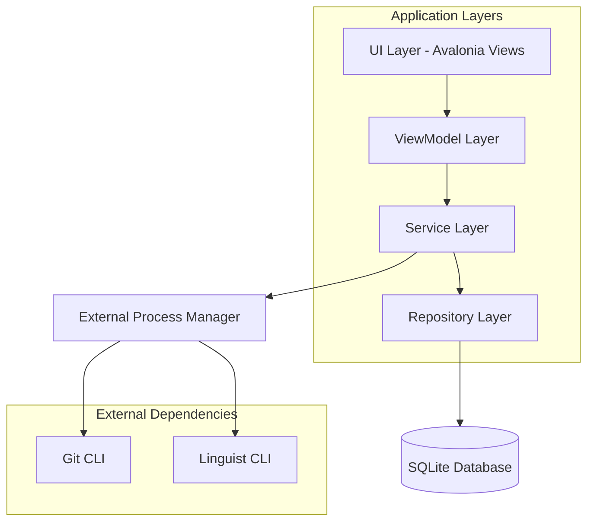
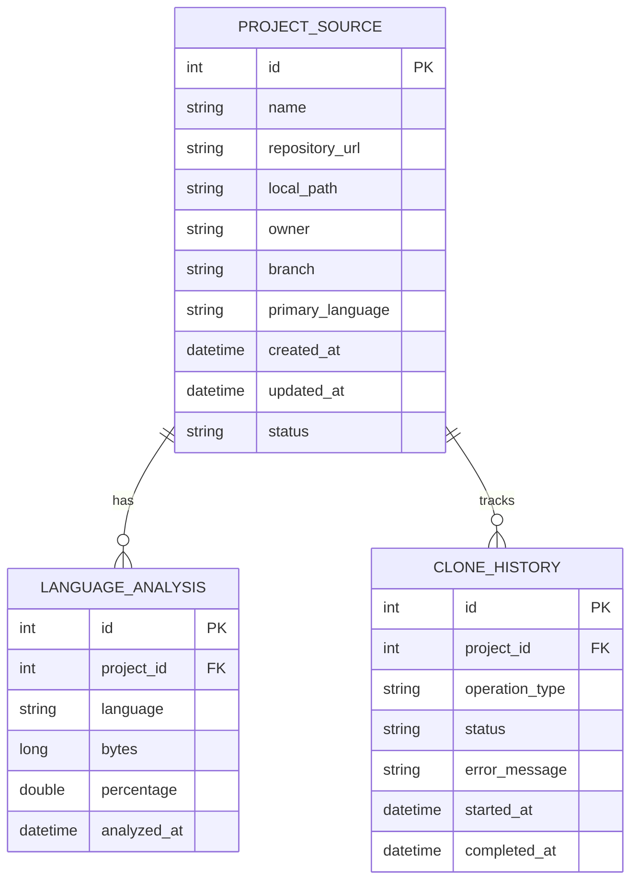

## 1.Architecture design



## 2.Technology Description

* Frontend: Avalonia UI\@11 + CommunityToolkit.Mvvm\@8 + Material.Avalonia\@3

* Backend: None (Desktop Application)

* Database: SQLite\@3 (Local storage)

* External Tools: Git CLI + Linguist CLI (F:\software\linguist-9.2.0)

## 3.Route definitions

| Route                        | Purpose              |
| ---------------------------- | -------------------- |
| /project-source              | 项目源管理主页面，显示项目列表和筛选功能 |
| /project-source/add          | 新增项目弹窗，Git URL输入和配置  |
| /project-source/clone/{id}   | 克隆进度页面，显示实时进度和状态     |
| /project-source/details/{id} | 项目详情页面，显示语言分析结果      |

## 4.API definitions

### 4.1 Core Services

**Git克隆服务**

```csharp
public interface IGitService
{
    Task<CloneResult> CloneRepositoryAsync(CloneRequest request, IProgress<CloneProgress> progress, CancellationToken cancellationToken);
    Task<RepositoryInfo> GetRepositoryInfoAsync(string url);
    Task<List<string>> GetBranchesAsync(string url);
}
```

**语言分析服务**

```csharp
public interface ILinguistService
{
    Task<LanguageAnalysisResult> AnalyzeProjectAsync(string projectPath, IProgress<AnalysisProgress> progress, CancellationToken cancellationToken);
    bool IsLinguistAvailable();
}
```

**项目仓储服务**

```csharp
public interface IProjectRepository
{
    Task<List<ProjectSource>> GetAllProjectsAsync();
    Task<ProjectSource> GetProjectByIdAsync(int id);
    Task<int> AddProjectAsync(ProjectSource project);
    Task UpdateProjectAsync(ProjectSource project);
    Task DeleteProjectAsync(int id);
}
```

### 4.2 Data Transfer Objects

**克隆请求**

```csharp
public class CloneRequest
{
    public string RepositoryUrl { get; set; }
    public string TargetPath { get; set; }
    public string Branch { get; set; }
    public bool UseShallowClone { get; set; }
    public string Username { get; set; }
    public string Password { get; set; }
}
```

**克隆进度**

```csharp
public class CloneProgress
{
    public string CurrentOperation { get; set; }
    public int ProgressPercentage { get; set; }
    public int ReceivedObjects { get; set; }
    public int TotalObjects { get; set; }
    public long ReceivedBytes { get; set; }
}
```

**语言分析结果**

```csharp
public class LanguageAnalysisResult
{
    public Dictionary<string, LanguageInfo> Languages { get; set; }
    public string PrimaryLanguage { get; set; }
    public long TotalBytes { get; set; }
    public DateTime AnalyzedAt { get; set; }
}

public class LanguageInfo
{
    public long Bytes { get; set; }
    public double Percentage { get; set; }
    public List<string> Files { get; set; }
}
```

## 5.Server architecture diagram



## 6.Data model

### 6.1 Data model definition



### 6.2 Data Definition Language

**项目源表 (project\_sources)**

```sql
-- create table
CREATE TABLE project_sources (
    id INTEGER PRIMARY KEY AUTOINCREMENT,
    name VARCHAR(255) NOT NULL,
    repository_url VARCHAR(500) NOT NULL UNIQUE,
    local_path VARCHAR(500) NOT NULL,
    owner VARCHAR(100),
    branch VARCHAR(100) DEFAULT 'main',
    primary_language VARCHAR(50),
    created_at DATETIME DEFAULT CURRENT_TIMESTAMP,
    updated_at DATETIME DEFAULT CURRENT_TIMESTAMP,
    status VARCHAR(20) DEFAULT 'pending' CHECK (status IN ('pending', 'cloning', 'completed', 'failed', 'analyzing'))
);

-- create index
CREATE INDEX idx_project_sources_status ON project_sources(status);
CREATE INDEX idx_project_sources_owner ON project_sources(owner);
CREATE INDEX idx_project_sources_language ON project_sources(primary_language);
```

**语言分析表 (language\_analysis)**

```sql
-- create table
CREATE TABLE language_analysis (
    id INTEGER PRIMARY KEY AUTOINCREMENT,
    project_id INTEGER NOT NULL,
    language VARCHAR(50) NOT NULL,
    bytes INTEGER NOT NULL,
    percentage REAL NOT NULL,
    analyzed_at DATETIME DEFAULT CURRENT_TIMESTAMP,
    FOREIGN KEY (project_id) REFERENCES project_sources(id) ON DELETE CASCADE
);

-- create index
CREATE INDEX idx_language_analysis_project_id ON language_analysis(project_id);
CREATE INDEX idx_language_analysis_language ON language_analysis(language);
```

**克隆历史表 (clone\_history)**

```sql
-- create table
CREATE TABLE clone_history (
    id INTEGER PRIMARY KEY AUTOINCREMENT,
    project_id INTEGER NOT NULL,
    operation_type VARCHAR(20) NOT NULL CHECK (operation_type IN ('clone', 'pull', 'analyze')),
    status VARCHAR(20) NOT NULL CHECK (status IN ('started', 'completed', 'failed', 'cancelled')),
    error_message TEXT,
    started_at DATETIME DEFAULT CURRENT_TIMESTAMP,
    completed_at DATETIME,
    FOREIGN KEY (project_id) REFERENCES project_sources(id) ON DELETE CASCADE
);

-- create index
CREATE INDEX idx_clone_history_project_id ON clone_history(project_id);
CREATE INDEX idx_clone_history_status ON clone_history(status);

-- init data
INSERT INTO project_sources (name, repository_url, local_path, owner, primary_language, status)
VALUES 
('Sample Project', 'https://github.com/sample/project.git', 'F:\\code\\sample-project', 'sample', 'C#', 'completed'),
('Demo Repository', 'https://github.com/demo/repo.git', 'F:\\code\\demo-repo', 'demo', 'JavaScript', 'completed');
```

