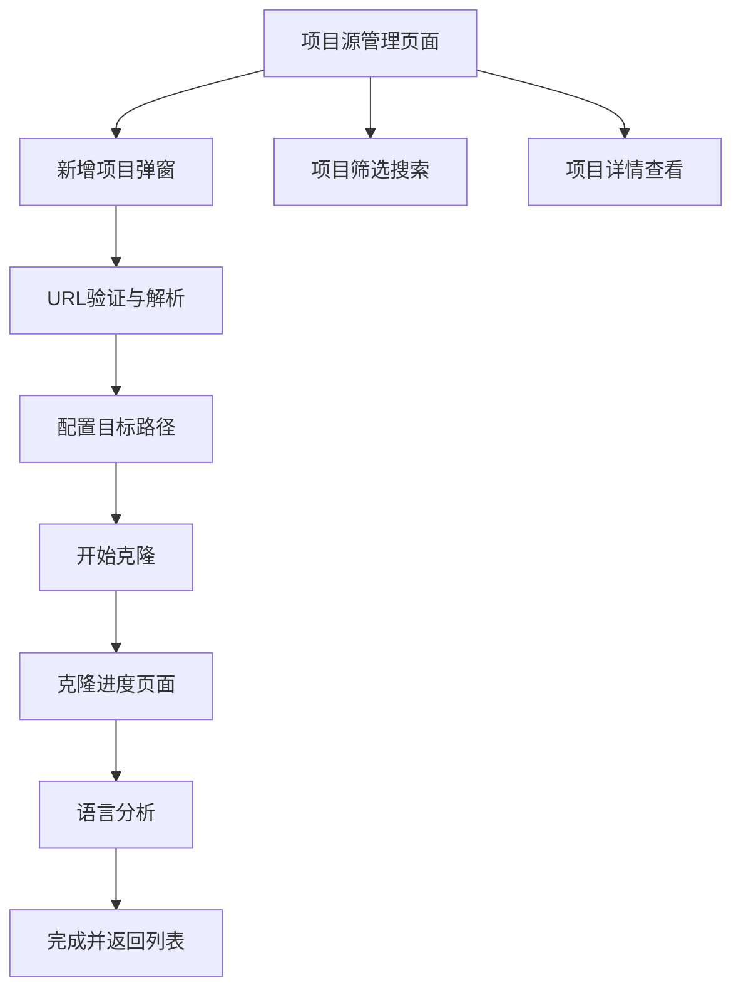

## 1. Product Overview
Project Source是一个Git项目管理页面，为开发者提供项目源码的集中管理、克隆和语言分析功能。用户可以通过直观的界面管理多个Git项目，快速克隆新项目到本地，并自动分析项目的编程语言构成，提升开发效率和项目组织能力。

## 2. Core Features

### 2.1 Feature Module
我们的Project Source需求包含以下主要页面：
1. **项目源管理页面**：项目列表展示、筛选搜索、项目信息卡片
2. **新增项目弹窗**：Git URL输入、目标路径配置、智能建议
3. **克隆进度页面**：实时进度展示、操作控制、错误处理

### 2.2 Page Details

| Page Name | Module Name | Feature description |
|-----------|-------------|---------------------|
| 项目源管理页面 | 项目列表区域 | Display project cards with repository info, language breakdown, clone status. Support grid/list view toggle |
| 项目源管理页面 | 筛选搜索栏 | Filter by language, project type, clone status. Real-time search by project name or URL |
| 项目源管理页面 | 操作工具栏 | Add new project button, refresh all, bulk operations, view settings |
| 新增项目弹窗 | URL输入区域 | Git URL input with paste support, real-time validation, repository info parsing |
| 新增项目弹窗 | 目标配置区域 | Target folder selection (default: F:\code), project name auto-generation, path conflict detection |
| 新增项目弹窗 | 智能建议区域 | Workspace recommendations, path optimization, branch selection suggestions |
| 新增项目弹窗 | 高级选项区域 | Branch selection, shallow clone option, authentication settings, post-clone actions |
| 克隆进度页面 | 进度展示区域 | Overall progress bar, detailed clone progress, language analysis progress |
| 克隆进度页面 | 操作控制区域 | Cancel operation, pause/resume, view logs, retry on failure |
| 克隆进度页面 | 状态信息区域 | Current operation status, error messages, completion notifications |

## 3. Core Process

用户首先进入项目源管理页面，查看已有项目列表，可以通过筛选和搜索快速定位项目。点击"新增项目"按钮打开克隆弹窗，输入Git URL后系统自动验证并解析仓库信息，用户配置目标路径和克隆选项后开始克隆。克隆过程中显示实时进度，完成后自动调用linguist分析项目语言构成，最终将项目添加到管理列表中。

## 4. User Interface Design

### 4.1 Design Style
- 主色调：深蓝色 (#1e3a8a) 和浅蓝色 (#3b82f6)
- 辅助色：灰色系 (#6b7280, #f3f4f6) 和成功绿色 (#10b981)
- 按钮样式：圆角矩形，渐变背景，悬停效果
- 字体：Microsoft YaHei UI，标题16px，正文14px，说明文字12px
- 布局风格：卡片式设计，顶部导航，响应式网格布局
- 图标风格：线性图标，统一16px尺寸，支持主题色彩

### 4.2 Page Design Overview

| Page Name | Module Name | UI Elements |
|-----------|-------------|-------------|
| 项目源管理页面 | 项目列表区域 | Grid layout with project cards, each card shows repo icon, name, language badges, clone date. Hover effects with shadow elevation |
| 项目源管理页面 | 筛选搜索栏 | Top toolbar with search input (magnifier icon), language filter dropdown, status filter chips, view toggle buttons |
| 新增项目弹窗 | URL输入区域 | Modal dialog 600x500px, URL input with validation indicator (green/red), repository info panel with owner/name display |
| 新增项目弹窗 | 目标配置区域 | Folder picker with browse button, project name input with auto-suggestion, full path preview with ellipsis |
| 克隆进度页面 | 进度展示区域 | Circular progress indicator, linear progress bars, percentage display, operation status text with icons |

### 4.3 Responsiveness
项目采用桌面优先设计，支持最小宽度1024px的显示器。项目卡片采用响应式网格布局，根据窗口宽度自动调整列数。弹窗和进度页面采用固定尺寸设计，确保在不同分辨率下的一致性体验。